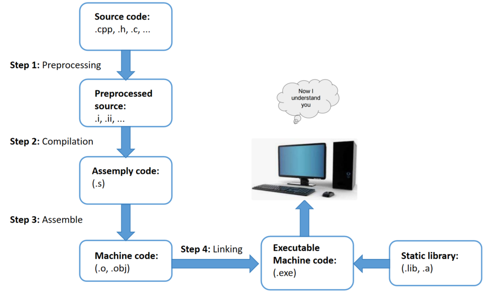

# Lesson 1: Compiler-Macro

## Compiler ##
<details close>

- Trình biên dịch là một chương trình máy tính được thiết kế để dịch code viết bằng một ngôn ngữ lập trình (source language) sang ngôn ngữ khác (the target language). 

- Compiler thường dùng biên dịch ngôn ngữ bậc cao (C++, Java,...) về ngôn ngữ bậc thấp hơn (ASM, object code,...) để tạo ra một chương trình mà máy tính có thể hiểu và thực thi được.


## Các bước biên dịch chương trình



### Bước 1: Preprocessing

Đầu tiên Compiler sẽ nhận source code, sau đó tiến hành các bước tiền xử lý: 
- **Include header**: Thay thế các dòng code bắt đầu bằng "#include" bằng toàn bộ nội dung đã code trong các file mà chương trình hiện tại (main) đang include.

- **Expand macro**: đọc nội dung macro đã được định nghĩa, mỗi khi macro được gọi thì tên macro được thay thế bằng nội dung của macro đó. Các loại macro khác nhau được xử lý theo những cách khác nhau (**sẽ được trình bày rõ trong phần Macro.**)

- **Xóa comment**: xóa toàn bộ các dòng comment được viết trong source code.

- **Tạo file .i/.ii**: sau khi thực hiện 3 bước trên, ta có nội dung code hoàn chỉnh của source code (main) được lưu dưới định dạng file .i (chỉ lưu ra một file duy nhất là file của chương trình chính).

Lệnh thực hiện trên terminal:
```c
gcc -E main.c -o main.i
```

### Bước 2: Preprocessing

Các file sau tiền xử lý (.i, .ii) được biên dịch thành các file assembly (.s). Bước này compiler sẽ vừa biên dịch vừa tìm lỗi.

Lệnh thực hiện trên terminal:
```c
gcc main.i -S -o main.s
```
### Bước 3: Assemble

Các file assembly được chuyển đổi thành các file mã máy (machine code hay object code) có định dạng .o(đối với c) hoặc .obj (đối với C++) bởi assembler.

Lệnh thực hiện trên terminal:
```c
gcc main.i -S -o main.s
```

### Bước 4: Linking

Cuối cùng linker sẽ kết hợp các file object code với các file thư viện (.lib, .a) để tạo thành một file chương trình có thể thực thi được (file .exe).

Lệnh thực hiện trên terminal, tạo main.exe và chạy nó:
```c
gcc test1.o test2.o main.o -o main
./main
```
</details>

## MACRO
<details close>

Là thuật ngữ chỉ những thông tin được xử lý ở quá trình tiền xử lý (Preprocessing). Có 3 loại macro chính:
- #include
- #define, #undef
- #if, #elif, #else, #ifdef, #ifndef

### \#include
Chỉ thị này dùng để chèn nội dung của một file code vào source code đang gọi chỉ thị #include và lưu lại nội dung mới dưới dạng file .i/.ii. 

Bằng chỉ thị #include ta có thể tái sử dụng code, phân chia chương trình thành các phần nhỏ để dễ dàng quản lý.

File sum.h
```c
int sum(int a, int b);
```
File main.c
```c
#include"sum.h"
int main(){return 0;}
```
File main.i
```c
int sum(int a, int b);
int main(){return 0;}
```
### \#define
Khi định nghĩa một macro bằng cách sử dụng tiền xử lý #define, mỗi khi macro được gọi trong source code thì compiler sẽ thay thể macro đó với nội dung nó được định nghĩa.
```c
#include <stdio.h>

#define SQUARE(x) ((x) * (x))
int main() 
{
 int result = SQUARE(5); // int result = ((5) * (5));
 printf("Result is: %d\n", result);
 return 0;
}
```

## \#undef

Để định nghĩa là macro trùng tên, ta phải hủy định nghĩa cũ trước đó của nó, sau đó mới được định nghĩa lại macro đó.

 Chỉ thị #undef dùng để hủy định nghĩa của một macro đã được 
định nghĩa trước đó bằng #define.

```c
#include <stdio.h>
#define SENSOR_DATA 42
int main() {
 printf("Value of MY_MACRO: %d\n", MY_MACRO); 
 // Hủy định nghĩa SENSOR_DATA
 #undef SENSOR_DATA
 // Định nghĩa SENSOR_DATA
 #define SENSOR_DATA 50
 printf("Value of MY_MACRO: %d\n", MY_MACRO);
 return 0;
}
```
Output:
> Value of MY_MACRO: 42 \
> Value of MY_MACRO: 50

## \#if, #elif, #else
Macro #if để bắt đầu một điều kiện tiền xử lý. 
Đoạn code dưới đây mô tả cách macro #if, #elif, #else hoạt động.
```c
#include <stdio.h>

// Định nghĩa một macro
#define CONDITION 3

int main() {
    // Sử dụng #if, #elif, #else
    #if CONDITION == 1                               // Điều kiện #if sai, lệnh #define không được thực thi
        #define SENSOR TRUE
    #elif CONDITION == 2                             // Tiếp tục kiểm tra với #elif
        #define SENSOR FALSE            
    #else                                          // Không có điều kiện nào ở trên đúng
        printf("FALIED.\n");
    #endif

    return 0;
}
```
## \#ifdef, #ifndef
#ifdef dùng để kiểm tra nếu macro đã được định nghĩa thì mã nguồn sau #ifdef sẽ được biên dịch.
#ifndef dùng để kiểm tra nếu macro chưa được định nghĩa thì mã nguồn sau #ifndef sẽ được biên dịch.
```c
#ifndef __ABC_H
#define __ABC_H
#endif

#ifdef __ABC_H
int a = 0;
#endif
```
##Macro function
Ta có thể dùng macro để định nghĩa function, khi macro function có nhiều dòng, ta gõ ký tự "\" để xuống dòng.
```c
#define SUM(a,b) \
printf("Tong la: ", a+b);\
return (a+b);
```
Viết macro function sẽ tối ưu về tốc độ hơn so với việc ta viết riêng định nghĩa function đó. Tuy nhiên macro function sẽ không tối ưu về bộ nhớ trên RAM.

## Toán tử \# và \#\# trong macro
Toán tử #: chuỗi nhập vào tự chuẩn hóa thành dạng chuỗi
```c
  #define CREATE_FUNC(func, cmd)  \
  void func() {                   \
      printf(#cmd);               
  }
  CREATE_FUNC (test1, this is function test1)

  //Kết quả quá trình preprocessing sẽ là:
  // void test1() {
  // printf("this is function test1");
  //}
```
Toán tử ##: nối các chuỗi lại với nhau.
```c
  #define CREATE_VAR(name)        \
  int int_##name;  
  CREATE_VAR(first)
  //Kết quả quá trình preprocessing sẽ là:
  // int int_first;
```

##Variadic macro
Là dạng macro khi định nghĩa có số lượng tham số đầu vào là bất định, cho phép người lập trình mở rộng không giới hạn số lượng tham số truyền vào.
Sử dụng cú pháp "..." biểu thị những tham số sau có thể mở rộng.
```c
// Định nghĩa variadic macro
#define PRINT_ARGS(format, ...) printf(format, __VA_ARGS__);

int main () { 
    PRINT_ARGS("Hello numbers %d, %f, %s", 10, 27.3, " OK") // printf("Hello numbers %d, %f, %s", 10, 27.3, " OK");
    return 0;}
```
</details>

# Lesson 2: STDARG - ASSERT

## Thư viện STDARG
<details close>
Là một thư viện chuẩn của ngôn ngữ C, cho phép định nghĩa hàm với số lượng tham số tùy ý.

Giả sử ta định nghĩa một hàm "void display(int count,...);", để sử dụng thư viện STDARD định nghĩa hàm trên ta cần hiểu rõ các thành phần sau:

**va_list val**: là một kiểu dữ liệu khi khai báo ta sẽ được một biến con trỏ là val, con trỏ này được khai báo để trỏ tới vùng nhớ của một chuỗi với các phần tử chuỗi lần lượt là địa chỉ của các tham số truyền vào.

**va_start(val, count)**: có tác dụng khởi tạo một chuỗi chứa các địa chỉ của các tham số được truyền vào hàm, ta tạm gọi chuỗi này là chuỗi A. Đầu tiên val sẽ được trỏ tới vùng nhớ trong chuỗi A chứa địa chỉ của biến count.

**va_arg(val, <type>)**: tại vị trí val đang trỏ tới (ví dụ là đang trỏ tới tham số count), trỏ tiếp tới vị trí tiếp theo trong chuỗi A, vị trí này mang giá trị là địa chỉ của tham số kế tiếp. Sau đó val được ép kiểu theo kiểu dữ liệu <type> được chỉ định.

**va_end(val)**: giải phóng bộ nhớ, kết thúc việc sử dụng chuỗi A mang các địa chỉ của tham số truyền vào

```c
#include <stdio.h>
#include <stdarg.h>

void display(int count, ...) {
    va_list av;
    va_start(av, count);
   
    printf("Value at 1: %d\n", va_arg(av,int)); 
    printf("Value at 2: %d\n", va_arg(av,int)); 

    va_end(va);
}

int main(){
    display(5, 6, 8,);
    return 0;
}

//OUTPUT: 
// Value at 1: 6
// Value at 2: 8
```
</details>

## Thư viện ASSERT
<details close>
Thư viện này sử dụng để hỗ trợ debug chương trình

**Hàm assert()**: dùng để khai báo điều kiện, nếu điều kiện đúng thì tiếp tục chương trình, nếu điều kiện sai thì chương trình sẽ dừng và báo lỗi tại vị trí code đang lỗi.

```c
#include <stdio.h>
#include <assert.h>
#include <math.h>

double canbachai(int a){
    assert( a >= 0 && "Giá trị đầu vào bé hơn 0");
    return (double) sqrt(b);
}

int main(int argc, char const*argv[])
{
    printf("Output: %f\n", canbachai(-4)); 
    return 0;
}
```
</details>

# Lesson 3: Pointer
<details close>

## 1. Con trỏ

Con trỏ là một biến có giá trị là địa chỉ vùng nhớ của một đối tượng (đối tượng có thế là biến, hàm, mảng, ...).

Con trỏ được định nghĩa theo cú pháp:

><kiểu dữ liệu>* <tên biến con trỏ>;

 Đối tượng mà con trỏ trỏ tới phải có kiểu giữ liệu cùng với kiểu dữ liệu của con trỏ.

Ví dụ: con trỏ kiểu int phải trỏ tới biến kiểu int.
```c
int a = 1;
float b = 10;

void* ptr1; // con trỏ void
int* ptr2 = &a; // con trỏ kiểu int trỏ tới địa chỉ biến int là a
float* ptr3 = &b; // con trỏ kiểu float trỏ tới địa chỉ biến float là b
```

## 2. Các kiểu con trỏ
### Con trỏ hàm (Function pointer)
Là kiểu con trỏ lưu giữ địa chỉ của một hàm.

**Cú pháp**

><kiểu dữ liệu trả về> (*<tên con trỏ>) (<các tham số đầu vào>);
```c
void (*ptr)(int, char*);

// khai báo con trỏ pointer trỏ tới hàm có thông số hàm đầu vào lần lượt mang kiểu giữ liệu (int, char*)

// Các hàm có tham số cùng số lượng, cùng kiểu dữ liệu đều có thể dùng con trỏ ptr để trỏ tới
```
**Ví dụ 1:** 

Sử dụng con trỏ trỏ tới các hàm cùng kiểu dữ liệu, cùng số lượng và kiểu tham số đầu vào.
```c
#include <stdio.h>

void tong(int a, int b) {
    printf("Tong %d va %d: %d\n", a, b, a + b);
}
void hieu(int a, int b) {
    printf("Hieu %d va %d: %d\n", a, b, a - b);
}
int main(int argc, char const *argv[]){
    void (*ptr)(int, int);
    ptr = &tong;
    ptr(10,15); // output: Tong 10 va 15: 25

    ptr = &hieu;
    ptr(10,15); // output: Hieu 10 va 15: -5

    return 0;
}
```
**Ví dụ 2:** 

Sử dụng con trỏ hàm lưu mảng chứa địa chỉ của nhiều hàm.
```c
#include <stdio.h>

void tong(int a, int b) {
    printf("Tong %d va %d: %d\n", a, b, a + b);
}
void hieu(int a, int b) {
    printf("Hieu %d va %d: %d\n", a, b, a - b);
}
int main(int argc, char const *argv[]){
    void (*array[2])(int, int) = {&tong, &hieu};
    array[0](10, 15); // output: Tong 10 va 15: 25
    array[0](10, 15); // output: Hieu 10 va 15: -5
    return 0;
}
```

**Ví dụ 3:**
Ứng dụng con trỏ hàm để truyền tham số vào một hàm, với tham số truyền là một hàm khác.
```c
void print(int(*ptr)(int, int), int a, int b)
{
    printf("Tong = %d\n", ptr(a, b));
}
int Cong(int a, int b)
{
    return a + b;
}
int main(int argc, char const *argv[]){
    print(&Cong, 5, 6); //output: Tong = 11
    return 0;
}
```
### Con trỏ void (void pointer)

Con trỏ hàm là kiểu con trỏ có thể trỏ đến bất kỳ kiểu dữ liệu nào.

Để sử dụng giá trị đối tượng mà con trỏ void trỏ tới, ta phải ép kiểu chính con trỏ void đó thành cùng kiểu dữ liệu với đối tượng đó.

**Cú pháp**

>void *<tên con trỏ>;

```c
int a = 1;
float b = 100;

float tong (float a, float b)
{
    return a + b;
}
int main(int argc, char const *argv[]) {
    void* ptr; // Khai báo ptr là con trỏ void
    
    ptr = &a;
    a = *(int*)ptr + 100;
    printf("Bien a = %d\n", a); // output: Biến a = 101

    ptr = &b;
    b = *(float*)ptr / 1000; // output: Biến b = 0.1
    printf("Bien b = %f\n", b); 

    ptr = &tong;
    float ketqua = ((float(*)(float, float))ptr) (10,12);
    printf("KQ = %f\n", ketqua); // output: KQ = 22
}
```
## Con trỏ NULL (NULL pointer)

Con trỏ NULL là con trỏ không trỏ tới bất kỳ một địa chỉ nào hết.

Con trỏ NULL có giá trị bằng 0 và địa chỉ cũng bằng 0.

Con trỏ NULL được dùng khi ta khai báo con trỏ nhưng chưa khai báo giá trị cho nó trỏ tới. Hoặc khi ta sử dụng xong một con trỏ ta phải gán nó bằng NULL.

**Tại sao sử dụng con trỏ NULL**

Khi ta khai báo một con trỏ, nó trỏ tới 1 địa chỉ rác không xác định địa chỉ này có thể là địa chỉ của một hàm hoặc một biến khác, gây ra lỗi không xác định. Khai báo một con trỏ là con trỏ NULL sẽ ngăn chặn điều này.

**Cú pháp**
><kiểu dữ liệu>* <tên con trỏ> = NULL;
```c
int* ptr = NULL;
```
## Hằng con trỏ (const pointer)
Là kiểu con trỏ được khai báo và trỏ tới một giá trị địa chỉ. 

Trong suốt quá trình chương trình thực thi, con trỏ hằng sẽ không thể thay đổi địa chỉ mà nó trỏ đến.

Người lập trình chỉ có thể giải tham chiếu để thay đổi giá trị chứa trong địa chỉ mà nó trỏ đến.

```c
#include <stdio.h>

int a = 10;
int b = 20;
int* const ptr = &a;

int main(int argc, char const *argv[]){
    printf("%p\n", ptr);
    printf("%d\n", *ptr);

    // Lỗi: Không được phép thay đổi giá trị của hằng con trỏ !
    ptr = &b;
    return 0;
}
```
## Con trỏ hằng (pointer to constant)

Là kiểu con trỏ trỏ đến một địa chỉ, và nó mặc định giá trị lưu trong địa chỉ đó là một giá trị hằng.

Người lập trình có thể đọc giá trị địa chỉ mà con trỏ hằng trỏ tới, tuy nhiên không thể giải tham chiếu con trỏ hằng để thay đổi giá trị được lưu tại địa chỉ đó.

Để thay đổi giá trị lưu trong địa chỉ con trỏ hằng trỏ tới, người lập trình phải gọi ra biến lưu địa chỉ này và thay đổi trực tiếp.

```c
#include <stdio.h>

int a = 10;
int b = 20;
const int* ptr = &a;

int main(int argc, char const *argv[]){
    printf("%p\n", ptr);  // 00007FF75E1B3010
    printf("%d\n", *ptr); // 10

    ptr = &b;
    printf("%p\n", ptr);  // 00007FF75E1B3014
    printf("%d\n", *ptr); // 20

    b = 100;
    printf("%p\n", ptr);  // 00007FF75E1B3014
    printf("%d\n", *ptr); // 100

    // Lỗi: Không được phép thay đổi giá trị của hằng con trỏ !
    *ptr = 100;

    return 0;
}
```
## Con trỏ trỏ đến con trỏ


</details>